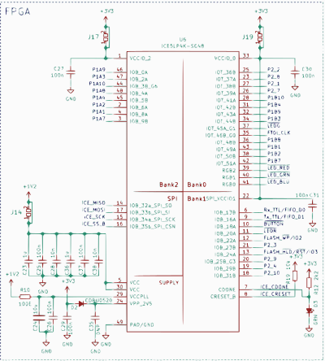
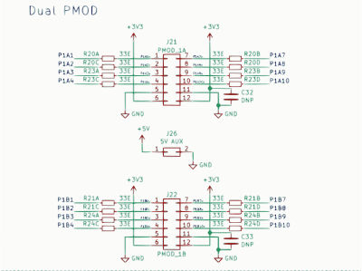
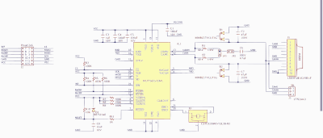
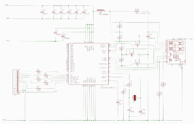
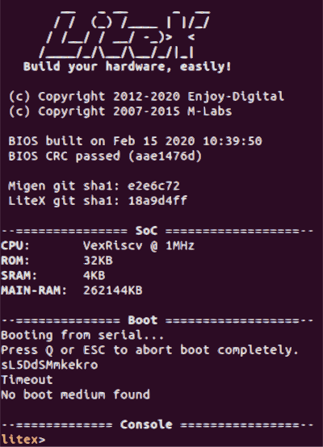

# Components

The main components of system architecture are broken down in Software and Hardware.

## Hardware

iCE40 FPGA chip has severfal Pmod interface (peripheral module interface) for connecting peripheral modules.

Pmod CAN and Pmod NIC100  are directly connected to FPGA via this interface : 

### CAN

Pmod CAN is a CAN 2.0B controller with an integrated transceiver. The embedded Microchip MCP25625 chip connects directly to the physical CAN Bus.

### Ethernet

The PmodNIC100 utilizes Microchip's ENC424J600 to provide both MAC
and PHY support to enable Ethernet functionality at data rates up to 10 Mbit/s.

## Gateware

We use Litex framework to program VexRiscv-SMP CPU Risc-V SOC on the iCEBreaker FPGA  that can be programmed from C language.

## Firmware

C language based device driver is used to program SPI interface that connects to CAN bus via MCP25625 and Ehternet via  ENC424J600.

## Application

Service to signal conversion layer is written to trasmit Ethernet based SOMEIP prototocol to CAN based signals. 
