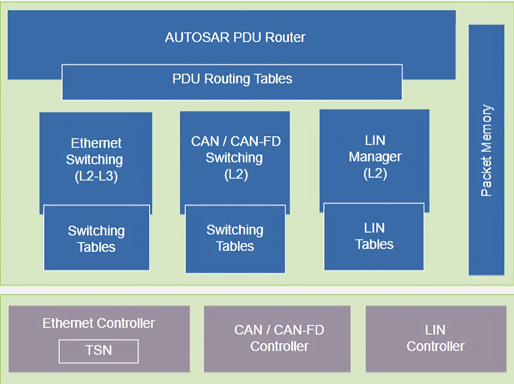

# Design

LibreCar FPGA runs a RISC-V  softcore complemented by peripherals for the implementation of physical interfaces such as CAN, Automotive Ethernet, and some general purpose interfaces (GPIO). Furthermore, the FPGA is supported by Flash and RAM memory.

The main functions of this design  is to come up with a Communication Engine which enables Routing or switching of data packets between all the interfaces based on:
* LIN data – based on LIN-ID (L2)
* CAN data – based on CAN-ID (L2)
* Ethernet / IP – based on Ethernet MAC & IP address (with TCP/UDP port for packet inspection)
* AUTOSAR PDU (Packet Data Unit) – In order to create a level of abstraction for signals from the physical entity of their ECU, AUTOSAR has introduced the concept of an AUTOSAR PDU (Protocol Data Unit).

This design helps us braking down into a set of functional groups:
* Switching layer
    * L2 CAN switching
    * L2 LIN switching
    * L2 Ethernet switching, L3 IP routing, L4 UDP/TCP port handling
* PDU handling
    * AUTOSAR PDU based routing
    * PDU aggregation

Using the above layers, we propose to implement Automotive protocols like Diagnostics, Logging and Measurement.