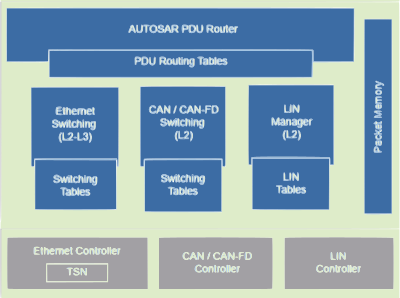

# Design

LibreCar FPGA runs a RISC-V  softcore complemented by peripherals for the implementation of physical interfaces such as CAN, Automotive Ethernet, and some general purpose interfaces (GPIO). Furthermore, the FPGA is supported by Flash and RAM memory.

The main functions of this design  is to come up with a Communication Engine which enables Routing or switching of data packets between all the interfaces based on:
    * LIN data – based on LIN-ID (L2)
    * CAN data – based on CAN-ID (L2)
    * Ethernet / IP – based on Ethernet MAC & IP address (with TCP/UDP port for packet inspection)
    * AUTOSAR PDU – based on AUTOSAR PDU ID

